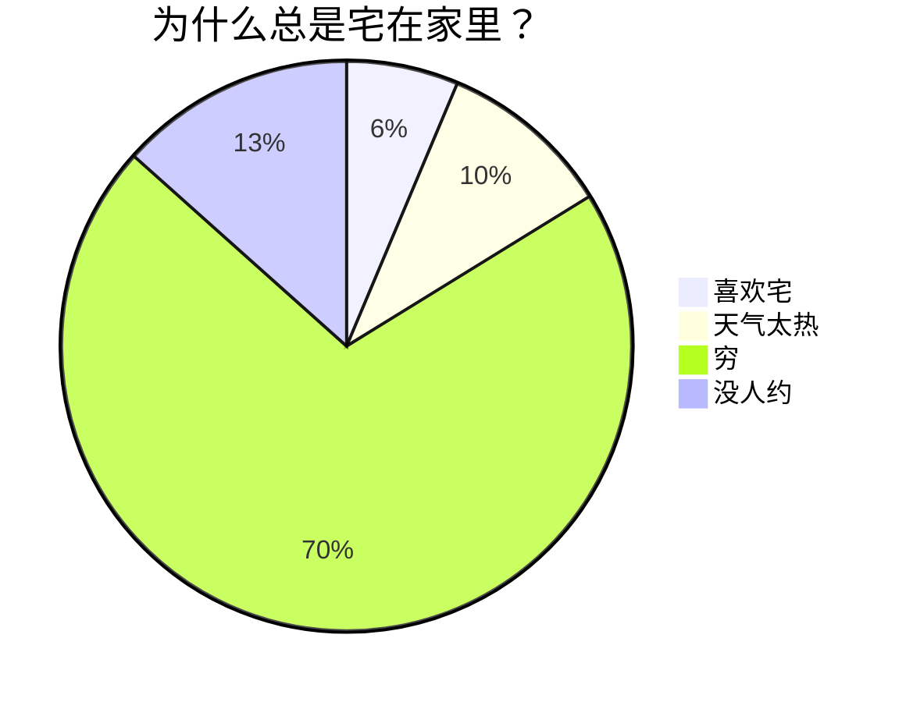

### 1. 标题：让你的内容层次分明

# 一级标题
## 二级标题
### 三级标题
#### 四级标题

---

### 2. 段落与换行：自然流畅

Markdown 是一种轻量级标记语言，用于格式化纯文本。

它以简单、直观的语法而著称，可以快速地生成 HTML。<br></br>Markdown 是写作与代码的完美结合，既简单又强大。

---

### 3. 字体样式：强调你的文字

**粗体文字**
_斜体文字_
_**粗体+斜体**_
~~删除线~~

---

### 4. 列表：整洁有序

**无序列表**
- 无序列表1
- 无序列表2

**有序列表**
1. 有序列表1
2. 有序列表2

**无序列表**
- 无序列表项1
  1. 嵌套有序列表项1
  2. 嵌套有序列表项2
- 无序列表项2

---

### 5. 链接与图片：丰富内容
[点击了解更多内容](https://github.com/doocs)


<div align="center">

</div>

---

### 6. 引用：细化内容结构

> 无论你是写作爱好者、开发者、博主，还是想要简单记录点什么的人，Markdown 都能成为你新的好伙伴。
> > Markdown 是一种轻量级标记语言，用于格式化纯文本。

---

### 7. 代码块：展示你的代码

- 行内代码示例：`print("input")`

```js
console.log("Hello, Doocs!");
```

```Python
print("Hello, Doocs!")
```

---

### 8. 分割线：分割内容

---
****
------

### 9. 表格：清晰展示数据

| 项目人员       | 邮箱              | 微信号        |
| :--------------| -----------------:| :-------------:|
| yanglbme      | constrwe@qq.com  | YL92109      |    
| djiasdj| sidwid@qq.com| dwdw|
| dwdwd| dwdw@.com | dwdw1232|

---

## Markdown 进阶技巧
### 1. LaTex 公式：完美展现数学表达式

- 行内公式示例：$E = mc^2$

$$
\begin{aligned}
d_{i, j} &\leftarrow d_{i, j} + 1 \\
d_{i, y + 1} &\leftarrow d_{i, y + 1} + 1 \\
d_{x + 1, j} &\leftarrow d_{x + 1, j} + 1 \\
d_{x + 1, y + 1} &\leftarrow d_{x + 1, y + 1} + 1 \\
\end{aligned}
$$

---

### 2. Mermaid 流程图：可视化流程


---
